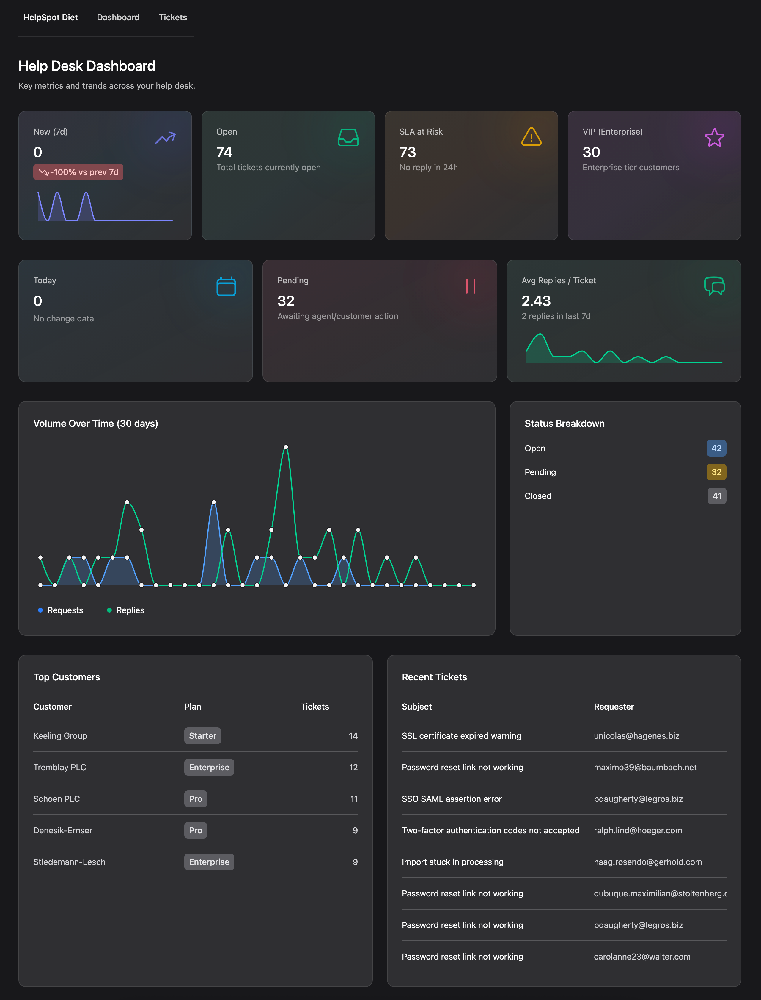

<h1 align="center">HelpSpot Diet</h1>

<p align="center">A lightweight help desk demo built with Laravel 12, Livewire v4, and Flux UI. Browse a dashboard of key metrics, triage the inbox, and reply to tickets – backed by seeded data.</p>

<p align="center">
  
  <br/>
  <em>Dashboard view with ticket metrics and trends</em>
  <br/><br/>
</p>

## What’s inside

- Laravel 12 + PHP 8.4
- Livewire v4 + Flux UI Pro components
- SQLite by default (simple local setup)
- Seeders that generate realistic tickets, customers, and replies
- Vite + Tailwind pipeline for assets

## Quick start (TL;DR)

1) Install backend deps

```
composer install
```

2) Create your env and app key

```
cp .env.example .env
php artisan key:generate
```

3) Use SQLite (default) and create the database file

```
mkdir -p database && touch database/database.sqlite
```

4) Migrate and seed demo data

```
php artisan migrate --seed
```

5) Install frontend deps and start Vite

```
npm install
npm run dev
```

6) Run the app

```
php artisan serve
```

Now visit the server URL from the output to see the dashboard and tickets.

Tip: Prefer one command? There’s a convenience script:

```
composer run dev
```

That runs the PHP server, queue worker, logs, and Vite together.

## Full setup details

- Environment
  - PHP 8.4+, Composer, Node 18+ (or 20+) and npm.
  - Defaults to SQLite. If you’d rather use MySQL/Postgres, update your `.env` and create the database before running migrations.

- Database
  - Fresh start at any time with: `php artisan migrate:fresh --seed`.
  - Seeders generate customers, tickets, and replies across realistic time ranges so the dashboard charts look real.

- Frontend
  - Development: `npm run dev` (hot reloading).
  - Production build: `npm run build`.
  - If UI changes aren’t showing, re-run `npm run dev` or `npm run build`.
## Troubleshooting

- “Unable to locate file in Vite manifest”: run `npm run build` (or keep `npm run dev` running) and reload.
- Blank data or empty charts: ensure `database/database.sqlite` exists and re-run `php artisan migrate --seed`.
- CSS/JS not updating: stop/restart `npm run dev`.

